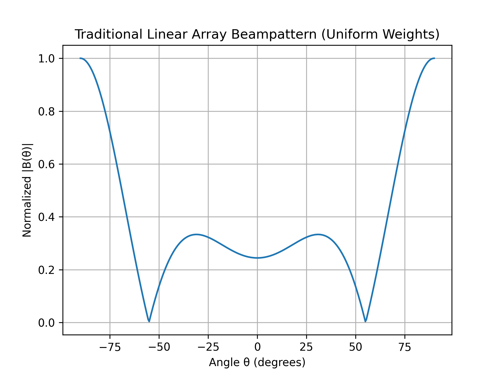
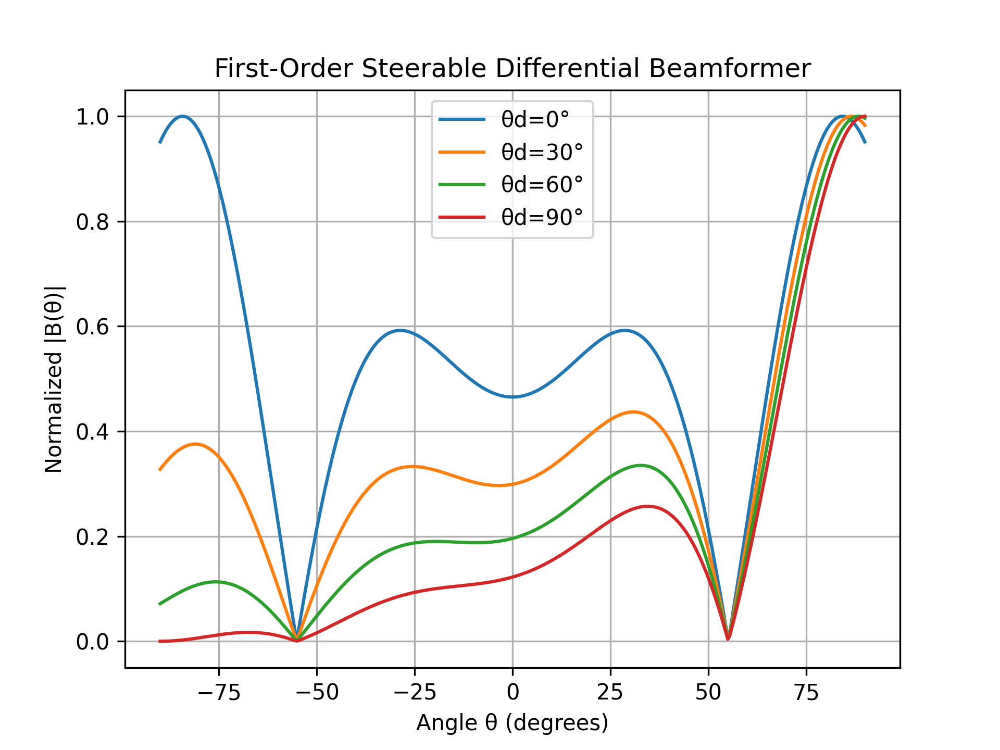
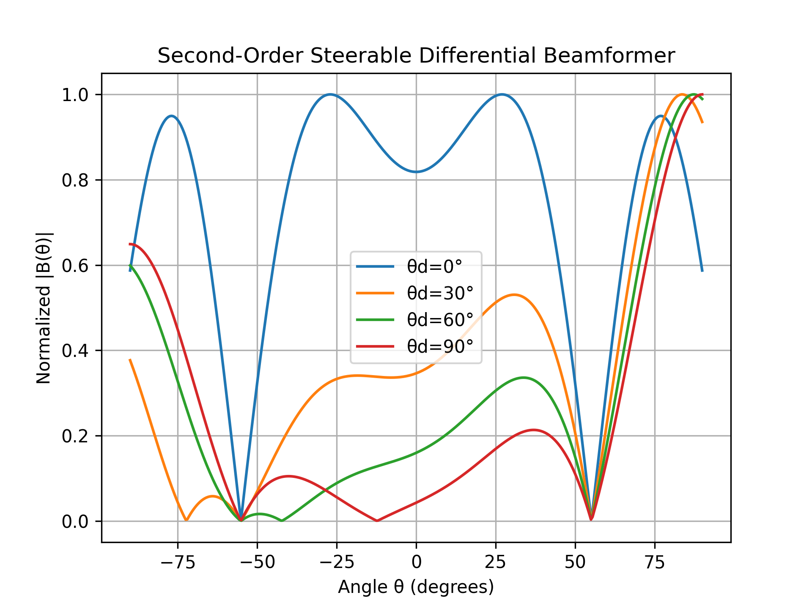
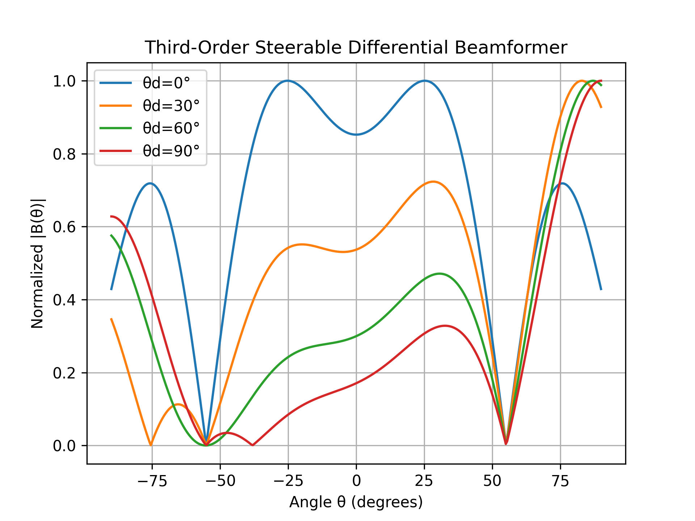
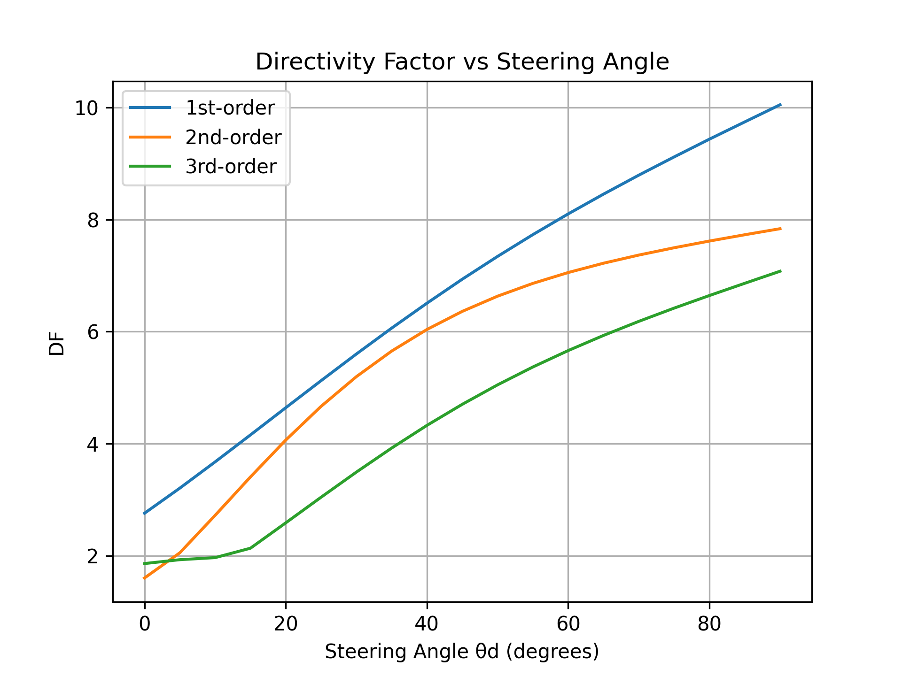
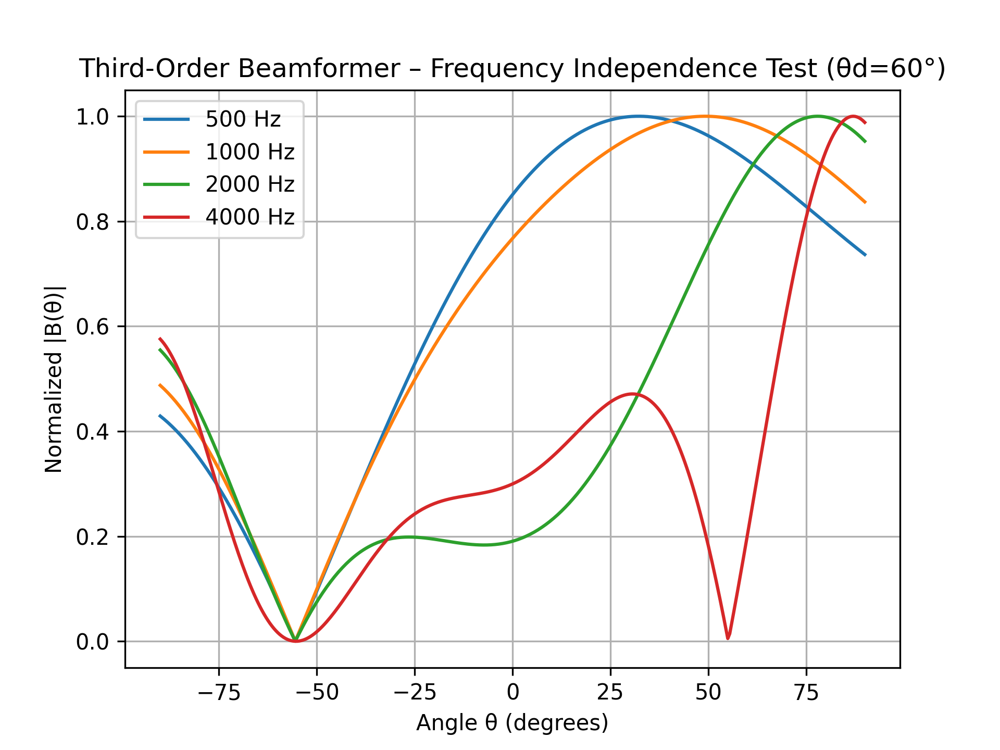

#  Steerable Differential Beamformer using Linear Acoustic Vector Sensors (LAVS)

This repository contains a full **Google Colab / Python reimplementation** of  
**“A Novel Method to Design Steerable Differential Beamformer Using Linear Acoustics Vector Sensor Array”**  
*(IEEE TASLP 2023, Feng Chen et al.)*.

---

##  Overview
This work reproduces every analytical and simulation result from the paper:

| Phase | Description |
|:--|:--|
| 1 | AVS signal model and steering vector derivation |
| 2 | Beampattern formulation and baseline array response |
| 3 | First-order steerable differential beamformer |
| 4 | Second- and third-order beamformers |
| 5 | Directivity-factor (DF) analysis vs. steering angle |
| 6 | Frequency-independence validation |

All code is written in **pure NumPy + Matplotlib**, runs fully on **CPU**, and is verified against the original figures.

---

## 📊 Output Results

### 1️ Traditional Linear Array

### 2️ First-Order Steerable Beamformer

### 3️ Second-Order Steerable Beamformer

### 4️ Third-Order Steerable Beamformer

### 5️ Directivity Factor vs Steering Angle

### 6️ Frequency Independence Test

---

## ⚙️ Usage

1. Open the notebook  
   **`Steerable_Differential_Beamformer_LAVS.ipynb`** in Google Colab.  
2. Run cells sequentially (Phases 1 → 6).  
3. All result plots will be saved automatically in the `plots/` folder.

---

##  Citation
If you use this code, please cite the original paper:

> Feng Chen et al., *“A Novel Method to Design Steerable Differential Beamformer Using Linear Acoustics Vector Sensor Array,”*  
> IEEE Transactions on Audio, Speech, and Language Processing, 2023.

---

## 🤝 Acknowledgment
Reimplemented and verified by **Soham Gupta **  
with analytical assistance from **ChatGPT** for formula translation and plotting.

---
